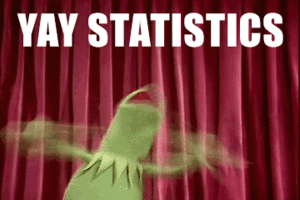

## ორიოდე სიტყვა შესავლის მაგივრად

### რას გავიგებ ამ კურსის ფარგლებში?
კურსის მიზანია, მსმენელებს გააცნოს სოციალურ მეცნიერებებში რაოდენობრივი ანალიზის მნიშვნელობა და გამოყენებით დონეზე შეასწავლოს ემპირიულ მონაცემებზე დაყრდნობით, აღწერითი და ახსნითი სტატისტიკური ანალიზის წარმოების ძირითადი პრინციპები. კურსის ფარგლებში სტუდენტები შეისწავლიან როგორც ე.წ. სიხშირული (frequentist) ასევე - ბაიესური (Bayesian) სტატისტიკის ამოსავალ პრინციპებს. 

</img>

კურსის გამოყენებით ნაწილში, სტუდენტები შეისწავლიან სტატისტიკური ანალიზის და დაპროგრამების თანამედროვე ენა R-ში მუშაობის ძირითად პრინციპებს. R სულ უფრო ფართოდ გამოიყენება რაოდენობრივ სოციალურ მეცნიერებებში, რაც გამოწვეულია მისი მოქნილობით, ღირებულებით (R უფასო პროგრამაა), მონაცემთა ვიზუალიზაციის და ანალიზის საშუალებების მრავალფეროვნებით. კურსის ფარგლებში, სტუდენტები დაეუფლებიან R-ში მონაცემთა დამუშავების ძირითად ხერხებს, აღწერითი და ახსნითი სტატისტიკური ანალიზის წარმოებას, მონაცემთა ვიზუალიზაციას და რეპროდუცირებადი (განმეორებადი) კვლევის საკვანძო ელემენტებს.

### რა დამჭირდება მიმდინარე კურსისთვის:

* R-ის ჩამოტვირთვა და დაინსტალირება
* R-Studio-ს ჩამოტვირთვა და დაინსტალირება
* ტექსტური რედაქტორის (Notepad++, Emacs, Aquamacs) ჩამოტვირთვა და დაინსტალირება

R-ის ჩამოტვირთვა CRAN-ქსელის უახლოესი სერვერიდან შეგიძლიათ - უბრალოდ, გადადით [ამ ბმულზე](https://ftp.uni-sofia.bg/CRAN/) და ჩამოწერეთ თქვენი საოპერაციო სისტემის შესაბამისი საინსტალაციო ფაილი. ინსტალაცია სტანდარტულია და თქვენგან მხოლოდ "Next" ღილაკზე დაჭერას მოითხოვს.

R-Studio-ს ჩამოტვირთვა [ამ ბმულიდან](https://www.rstudio.com/products/rstudio/download3/) მოგიწევთ. შეარჩიეთ თქვენი საოპერაციო სისტემის შესაბამისი ფაილი, გადმოწერეთ, დააჭირეთ "Next"-ს და დააინსტალირეთ.

ტექსტური რედაქტორი მხოლოდ იმ შემთხვევაში დაგვჭირდება, როდესაც პროგრამასთან ერთად, ტექსტის მომზადება, მაგალითად, ლაბორატორიული დავალებისთვის მცირე ანალიტიკური ანგარიშის დაწერა მოგიხდებათ. ქვემოთ მოცემული ცხრილიდან აარჩიეთ თქვენთვის [მოსაწონი](https://www.youtube.com/watch?v=89tH19TH3Z8) ტექსტური რედაქტორი, ჩამოტვირთეთ და დააინსტალირეთ.

| საოპერაციო სისტემა              | ტექსტური რედაქტორი |
|---------------------------------|--------------------|
| Windows (XP, 7, Vista, 8.n, 10) | [Notepad++](https://notepad-plus-plus.org/download/v7.2.html), [Emacs](https://www.gnu.org/software/emacs/download.html)   |
| (MAC) OS X                      | [Aquamacs](http://aquamacs.org/download.shtml), [Emacs](https://www.gnu.org/software/emacs/download.html)    |
| Linux-ის დისტრიბუტივები         | [Emacs](https://www.gnu.org/software/emacs/download.html)              |
### კურსის სტრუქტურა

მიმდინარე კურსი თეორიული და პრაქტიკული კომპონენტებისგან შედგება. თეორიული ნაწილი სალექციო მასალას და შესაბამის ლიტერატურის გაცნობას მოიცავს, ხოლო პრაქტიკული კომპონენტი ლაბორატორიულ სამუშაოებს და საშინაო დავალებეს. კურსის ფარგლებში, კვირაში ერთხელ, ორი საათით ვხვდებით. პირველი საათი თეორიული მასალის ახსნას, ხოლო მეორე საათი - თემატურ ლაბორატორიულ სამუშაოს დაეთმობა. კურსთან დაკავშირებული ყველა მასალა, სილაბუსის, შეფასებების, პრეზენტაციების, ტექსტის, წიგნების, მონაცემთა ბაზების და სკრიპტების ჩათვლით, ამ ვებსაიტზე განთავსდება.

#### ლაბორატორია
ლაბორატორიული სამუშაო კურსის პრაქტიკული კომპონენტის ნაწილია. შეხვედრის მეორე საათზე დაგირიგდებათ დავალებები დეტალური აღწერით, რომლის პასუხები, R-ბლოკნოტის სახით, კვირის განმავლობაში, დროპბოქსის სპეციალურ მისამართზე უნდა ატვირთოთ. თითოეული დავალების აღწერა და ასატვირთი ბმული მოცემულია სილაბუსის [გვერდზე](https://davidsichinava.github.io/introstatsr/pages/topic.html) და ლაბორატორიული სამუშაოების აღწერის ფაილში.

ლაბორატორიული დავალებები ასევე მოიცავს ანოტირებული ბიბლიოგრაფიის მომზადებას.

#### დასწრება

თითოეული გაცდენა არასაპატიოდ ითვლება. თუკი მოსვლას ვერ ახერხებთ, წინასწარ უნდა გამაფრთხილოთ. გაითვალისწინეთ, რომ ლექციაზე არდასწრება ლაბორატორიული სამუშაოს შესრულების ვალდებულებას არ ხსნის.

#### საბოლოო პროექტი

კურსის შეფასების მნიშვნელოვანი ნაწილი საბოლოო პროექტის ხარისხზე იქნება დამოკიდებული. პროექტი ე.წ. საკონფერენციო სტატიის (Conference Paper) ფორმით უნდა წარმოადგინოთ, სადაც მოცემული იქნება როგორც თქვენი საკვლევი თემის შესახებ მცირე თეორიული ექსკურსი, ასევე - მონაცემთა ანალიზის შედეგები.

#### სად ვიპოვო კურსთან დაკავშირებული მასალები?

* კურსის [ვებსაიტზე](https://davidsichinava.github.io/dat)
* კურსის სილაბუსის [გვერდზე](https://davidsichinava.github.io/dar/pages/topic.html)

#### საკონტაქტო ინფორმაცია

კითხვების, კომენტარების, ასევე - შეცდომების აღმოჩენის შემთხვევაში და ა.შ., მომმართეთ პირადად ან ელექტრონულ ფოსტაზე: david.sichinava@tsu.ge

ლექციები ჩატარდება პარასკევობით, თსუ მე-3 კორპუსში, 208-ე აუდიტორიაში.
