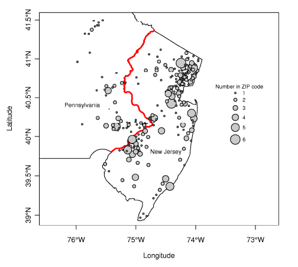

<div class="header" style="margin-top:0 px;font-size:60%;">რმაRგ: მეოთხე შეხვედრა</div>

რაოდენობრივ მონაცემთა ანალიზი R-გარემოში
========================================================
author: დავით სიჭინავა
date: 13 აპრილი, 2018
autosize: true
transition: none
css: css/style.css
font-family: 'BPG_upper'
<span style="font-weight:bold; font-family:BPG_upper;">მეოთხე შეხვედრა</span>


დღევანდელი შეხვედრის გეგმა
========================================================

- მიზეზშედეგობრიობა
	+ მიზეზშედეგობრივი ეფექტები
	+ ჰიპოთეტური ფაქტი (counterfactual)
- რანდომიზებული კონტროლირებული ექსპერიმენტები
- კვაზიექსპერიმენტული დიზაინები
	+ ,,საწყისი და შემდგომი დიზაინი'' (Before-and-after design)
	+ ,,სხვაობათა სხვაობა'' (Difference-in-Difference)

Bertrand & Mullainathan (2004)
========================================================
_Are Emily and Greg more employable than Lakisha and Jamal? A field experiment on labor market discrimination_. American Economic Review, vol. 94, no. 4, pp. 991–1013.

Bertrand & Mullainathan (2004)
========================================================

* არსებობს თუ არა რასობრივი დისკრიმინაცია დასაქმების სფეროში?
* სხვა სიტყვებით რომ ვთქვათ, _იწვევს_ თუ არა კონკრეტული რასისადმი კუთვნილება პიროვნების დისკრიმინაციას შრომის ბაზარზე?

Bertrand & Mullainathan (2004)
========================================================
| ცვლადი    | აღწერა                                |
|-----------|---------------------------------------|
| firstname | აპლიკანტის სახელი                     |
| sex       | სქესი                                 |
| race      | რასა                                  |
| call      | შეეხმიანენ თუ არა აპლიკანტს ტელეფონზე |


Bertrand & Mullainathan (2004)
========================================================

```r
### მონაცემების გადმოტვირთვა შეგიძლიათ შემდეგი ლინკიდან: https://goo.gl/W3YS1i 
### ან - ფლეშკიდან
resume <- read.csv("resume.csv")
```

Bertrand & Mullainathan (2004)
========================================================

```r
head(resume)
table(resume$race)
table(resume$call)
prop.table(table(resume$call, resume$race), 1)
```

მიზეზშედეგობრიობა
========================================================
* შესაძლებელია, ეს დასკვნა _მიზეზშედეგობრივად_ ჩავთვალოთ?
	+ რატომ?

მიზეზშედეგობრიობა: ჰიუმი, მილი, ნეიმანი
========================================================
* ,,პირველი ობიექტის არარსებობის შემთხვევაში, არც მომდევნო იარსებებდა"
* ,,თუ ადამიანი რაიმე საკვებს მიიღებს და ამის შედეგად მოკვდება, არ მოკვდებოდა, ეს კერძი რომ არ ეგემა. შესაბამისად, სხვები იტყვიან, რომ ამ საკვების მირთმევა კლავს"
* ჰიპოთეტური ფაქტები (კონტრფაქტები)
	+ რა მოხდებოდა, რომ...


ნეიმან-რუბინ-ჰოლანდის მიზეზშედეგობრივი სტატისტიკური დასკვნის მოდელი
========================================================
- ყოველი $i$-თვის, $T{i}$ ექსპერიმენტის მიზეზშედეგობრივი ეფექტი განიმარტება, როგორც $Y_{i}(1) - Y_{i}(0)$, სადაც $Y_{i}(1)$ წარმოადგენს შედეგს, რომელსაც ექსპერიმენტულ ჯგუფში მივიღებდით, ხოლო $Y_{i}(0)$ - შედეგს, რომელიც საკონტროლო ჯგუფში გვექნებოდა
- მიზეზშედეგობრივი სტატისტიკური დასკვნის ფუნდამენტური პრობლემა


ჰიპოთეტური ფაქტები
========================================================
>> მიზეზშედეგობრივი სტატისტიკური დასკვნის მიზანი ჰიპოთეტური ფაქტების პროგნოზია


შემთხვევითი განაწილების (რანდომიზაციის) როლი
========================================================
* ჰომოგენური ჯგუფების შექმნა - განსხვავება მხოლოდ ექსპერიმენტულ პირობას შეიძლება, დავაბრალოთ
* შერჩევის შეცდომა (Selection bias)
* დიდ რიცხვთა კანონი

რანდომიზებული კონტროლირებული ექსპერიმენტი
========================================================

$Y_{i}(1) - Y_{i}(0)$

შერჩევის საშუალო ექსპერიმენტული ეფექტი - Sample Average Treatment Effect (SATE)

$SATE = \frac{1}{n}\sum_{n}^{i=1}\left \{ Y_{i}(1) - Y_{i}(0) \right \}$

რანდომიზებული კონტროლირებული ექსპერიმენტი
========================================================

- ისევ: მიზეზშედეგობრივი სტატისტიკური დასკვნის ფუნდამენტური პრობლემა
- განსხვავება საშუალებებში (difference-in-means)
$\hat{\tau} = \frac{1}{n_{1}}\sum_{i=1}^{n}T_{i}Y_{i} - \frac{1}{n_{0}}\sum_{i=1}^{n}(1-T_{i})Y_{i}$


მეთოდოლოგიური გამოწვევები (Imai, 2012)
========================================================

* რანდომიზებული ექსპერიმენტებიც მოითხოვს რთულ სტატისტიკურ ანალიზს
* პროტოკოლიდან გადახვევა
	+ ,,დაჭუჭყიანება'', გარე ეფექტები
	+ დაუმორჩილებლობა
	+ ცარიელი მნიშვნელობები, გაზომვის ცდომილება
* ექსპერიმენტის ეფექტი
	+ ჰეტეროგენურობა
	+ მიზეზშედეგობრივი მექანიზმის შეცდომით გაგება
* გენერალიზება
	+ შიდა და გარე ვალიდობის საკითხები

(კვაზი)ექსპერიმენტული დიზაინები
========================================================
* ექსპერიმენტული და დაკვირვებითი მონაცემები
* პრაქტიკაში, რანდომიზაცია რთულია, ან - შეუძლებელი, შესაბამისად, მიზეზშედეგობრივი დასკვნების გამოსატანად, კვაზიექსპერიმენტული მიდგომები გამოიყენება;
* ამ შემთხვევაში, ექსპერიმენტული ჩარევა შემთხვევით არაა განაწილებული, არამედ, ვუშვებთ, რომ შეგვიძლია, _მივბაძოთ_ რანდომიზებული დიზაინს;
* მაგალითად:
	+ ბუნებრივი ექსპერიმენტები;
	+ რეგრესიული წყვეტა;
	+ დაკავშირების დიზაინი (matching);
	+ პანელური მონაცემები;
	+ სინთეტური კონტროლები და ა.შ.


Card & Krueger (1994)
========================================================
* მინიმალური ხელფასის ცვლილება
* იმოქმედა თუ არა ხელფასის მომატებამ დასაქმებაზე?

Card & Krueger (1994)
========================================================

```r
### გადმოწერეთ მონაცემები შემდეგი ლინკიდან: https://goo.gl/rgbAxj

### ან - ფლეშკიდან
resume <- read.csv("resume.csv")
```

Card & Krueger (1994)
========================================================

```r
dim(minwage) ### ,,განზომილებები''

summary(minwage) ### აღწერითი სტატისტიკა
```

Card & Krueger (1994)
========================================================
- ,,ექსპერიმენტული ჯგუფი'': სწრაფი კვების რესტორნები ნიუ-ჯერსიში
- ,,საკონტროლო ჯგუფი'': სწრაფი კვების რესტორნები პენსილვანიაში


Card & Krueger (1994)
========================================================


Card & Krueger (1994): ამოცანა
========================================================
- გამოვთვალოთ საშუალოთა შორის სხვაობას, რაც თეორიულად ექსპერიმენტულ ეფექტზე მიგვითითებს
- დამოკიდებული ცვლადი: სრულ განაკვეთზე დასაქმებულთ პროპორცია


Card & Krueger (1994)
========================================================

```r
## ამოვარჩიოთ ორი შტატის მონაცემები
minwageNJ <- subset(minwage, subset = (location != "PA"))
minwagePA <- subset(minwage, subset = (location == "PA"))
```

Card & Krueger (1994)
========================================================

```r
## create a variable for proportion of full-time employees in NJ and PA
minwageNJ$fullPropAfter <- minwageNJ$fullAfter / (minwageNJ$fullAfter + minwageNJ$partAfter)
minwagePA$fullPropAfter <- minwagePA$fullAfter / (minwagePA$fullAfter + minwagePA$partAfter)

## compute the difference-in-means
mean(minwageNJ$fullPropAfter) - mean(minwagePA$fullPropAfter)
```
Card & Krueger (1994)
========================================================

```r
## create a variable for proportion of full-time employees in NJ and PA
minwageNJ$fullPropAfter <- minwageNJ$fullAfter / (minwageNJ$fullAfter + minwageNJ$partAfter)
minwagePA$fullPropAfter <- minwagePA$fullAfter / (minwagePA$fullAfter + minwagePA$partAfter)

## compute the difference-in-means
mean(minwageNJ$fullPropAfter) - mean(minwagePA$fullPropAfter)
```

დამატებითი ცვლადის ეფექტი
========================================================
- ცვლადი, რომელიც ,,აჭუჭყიანებს'' ექსპერიმენტსა და შედეგს შორის კაუზალურ კავშირს
- სტატისტიკური კონტროლი

დამატებითი ცვლადის ეფექტი
========================================================


```r
prop.table(table(minwageNJ$chain))
prop.table(table(minwagePA$chain))
```

დამატებითი ცვლადის ეფექტი
========================================================

```r
## ამოვარჩიოთ მხოლოდ ბურგერ-კინგი
minwageNJ.bk <- subset(minwageNJ, subset = (chain == "burgerking"))
minwagePA.bk <- subset(minwagePA, subset = (chain == "burgerking"))

## შევადაროთ მხოლოდ ბურგერ-კინგები
mean(minwageNJ.bk$fullPropAfter) - mean(minwagePA.bk$fullPropAfter)
```
დამატებითი ცვლადის ეფექტი
========================================================

```r
## მდებარეობა?

minwageNJ.bk.subset <- subset(minwageNJ.bk, subset = ((location != "shoreNJ") & (location != "centralNJ")))
mean(minwageNJ.bk.subset$fullPropAfter) - mean(minwagePA.bk$fullPropAfter)
```

,,საწყისი და შემდგომი დიზაინი''
========================================================

```r
## სრულ განაკვეთზე მომუშავეთა წილი საწყის პერიოდში
minwageNJ$fullPropBefore <- minwageNJ$fullBefore / (minwageNJ$fullBefore + minwageNJ$partBefore)
## საშუალოთა სხვაობა
NJdiff <- mean(minwageNJ$fullPropAfter) - mean(minwageNJ$fullPropBefore)
NJdiff
```
,,საწყისი და შემდგომი დიზაინი''
========================================================


,,საწყისი და შემდგომი დიზაინი''
========================================================


,,სხვაობათა სხვაობა''
========================================================

```r
## პენსილვანია: პროპორციათა შორის სხვაობა
minwagePA$fullPropBefore <- minwagePA$fullBefore / (minwagePA$fullBefore + minwagePA$partBefore)

## ნიუ-ჯერსი: პროპორციათა შორის სხვაობა
PAdiff <- mean(minwagePA$fullPropAfter) - mean(minwagePA$fullPropBefore)

## სხვაობათა სხვაობა
NJdiff - PAdiff
```

