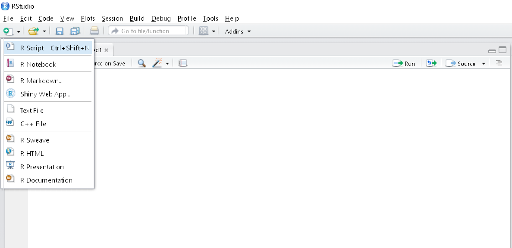
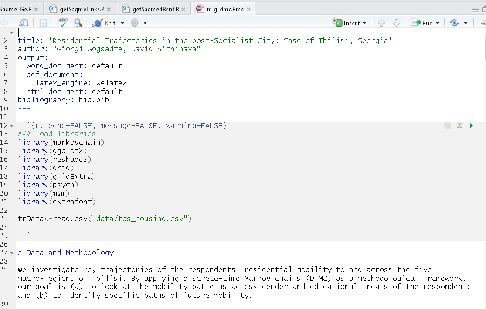

####  გეგმა:
* შესავალი R-გარემოში
* R-ის მომხმარებლის გრაფიკული გარემო: R-Studio
* R-ის მომხმარებლის გრაფიკული გარემოს ძირითადი ელემენტები
* R-მარკირების დოკუმენტის შექმნა
* ,,წიგნიერი პროგრამირება'' და პროექტების ორგანიზების კარგი პრაქტიკა 
* მონაცემების წაკითხვა R-გარემოში
* მონაცემთა ტიპები და ვექტორული ობიექტები
	+ ატომური ობიექტები (სიმბოლო, ლოგიკური, მთელი და ათწილადი რიცხვები)
	+ სია
	+ ატრიბუტი
	+ ფაქტორი
	+ მასივი და მატრიცა
	+ მონაცემთა ჩარჩო


### საკითხავი მასალა ლაბორატორიული სამუშაოსთვის

_წინამდებარე თავი ნაწილობრივ ეფუძნება თორფსის და ბრაუერის [სტატიას](https://cran.r-project.org/doc/contrib/Torfs+Brauer-Short-R-Intro.pdf):_ Torfs, P. and Brauer, C.: _A (very) short introduction to R_, ჰედლი უიქჰემის წიგნს [Advanced R](http://adv-r.had.co.nz/Data-structures.html), ჯონ ვერზანის ,,simpleR''-ს და DataCamp-ის [სახელმძღვანელოს](https://www.datacamp.com/community/tutorials/r-data-import-tutorial)_


#### რა არის R?


[R](https://www.r-project.org/about.html) სტატისტიკური გამოთვლის და ვიზუალიზაციის გარემოა, რომელსაც საფუძვლად ბელის ლაბორატორიაში შექმნილი [S-დაპროგრამების ენა](http://ect.bell-labs.com/sl/S/) უდევს. 1993 წელს, ოკლენდის უნივერსიტეტში მუშაობისას, რობერტ ჯენტლმენმა და როს იჰაკამ გადაწყვიტეს, სტატისტიკური გამოთვლების საჭიროებაზე მორგებული სპეციალიზებული დაპროგრამების ენა შეექმნათ, რომელსაც ღია კოდი ექნებოდა და მის განვითარებაში საკუთარი წვლილის შეტანას ნებისმიერი მსურველი შეძლებდა. R-ის პირველი ოფიციალური ვერსია (1.0.0) 2000 წელს გამოვიდა და უკანასკნელი თექვსმეტი წლის მანძილზე, უამრავი მომხმარებელი შეიძინა. პროექტის პოპულარობაზე ისიც მეტყველებს, რომ R-ისთვის მომხმარებლების მიერ შექმნილი ბიბლიოთეკების (დამატებითი მოდულების) რაოდენობა 9 ათასამდე აღწევს [@smith2016].
 
<span style="width: 500px; display:inline-block; text-align:center;">
</img>
    <span class="caption"; font-size: 6pt">ნახ. 1.1: 2016 წელს მსოფლიოში ყველაზე ხშირად გამოყენებული დაპროგრამების ენები, IEEE</span>
</span>

ავტორიტეტული ორგანიზაციის, ელეტრონიკის და ელექტროტექნიკის ინსტიტუტის კვლევის [@diakopoulos_interactive_2016]თანახმად კი R მსოფლიოში მეხუთე ყველაზე აქტიურად გამოყენებადი დაპროგრამების ენაა (ნახ. 1.1). ამჟამად R-ის პროგრამული ბირთვის განვითარებაზე სპეციალური ჯგუფი მუშაობს.

R საგრძნობლად განსხვავდება თქვენთვის ნაცნობი სხვა სტატისტიკური პროგრამებისგან (SPSS, STATA და ა.შ.). ეს უკანასკნელები საკმაოდ ვიწრო გამოთვლითი ამოცანების გადაწყვეტაზე არიან მორგებული. R-ის უპირატესობა იმაში მდგომარეობს, რომ იგი დაპროგრამების ენაა. ამგვარი მოქნილობა უზარმაზარი მოცულობის მონაცემთა მასივების აურაცხელი მეთოდებით გაანალიზების საშუალებას იძლევა.

პროგრამა სადღეისოდ ყველა პოპულარული საოპერაციო სისტემისთვისაა გამართული, მათ შორის, ვინდოუსის, Mac OS და ლინუქსის სხვადასხვა დისტრიბუტივებისთვის. რაც მთავარია, R უფასო პროგრამაა, რომელიც [GPL-2 | GPL-3](https://ka.wikipedia.org/wiki/GNU_General_Public_License) ლიცენზიით ვრცელდება და მისი გამოყენება ნებისმიერ მსურველს უფასოდ შეუძლია.

R-ს სხვა სტატისტიკური პროგრამებისგან ისიც გამოარჩევს, რომ მას ამომწურავი დოკუმენტაცია და მომხმარებელთა მრავალრიცხოვანი საზოგადოება გააჩნია. კითხვა-პასუხის და საცნობარო ვებსაიტების (მაგალითად, [StackExchange](http://stackoverflow.com/questions/tagged/r)) მეშვეობით, თითქმის ყველა პრობლემის გადაჭრის გზას იპოვით. ინტერნეტში მრავლადაა R-ის თვითმასწავლებლები და ონლაინ კურსები ([UCLA ATS](http://www.ats.ucla.edu/stat/r/), [Data Camp](https://www.datacamp.com/courses/free-introduction-to-r), [Coursera](https://www.coursera.org/courses?languages=en&query=R)...).


### რა არის R-Studio?


R-ის ერთ-ერთ უარყოფით მხარედ კარგა ხანს სახელდებოდა გრაფიკული სამომხმარებლო გარემოს (ინტერფეისის) არარსებობა. თუმცა აღნიშნული პრობლემა მოგვარებულია სპეციალური პროგრამის, R-Studio-ს გამოჩენის შემდეგ. მიმდინარე კურსის ფარგლებში სწორედ R-Studio-ს გარემოში ვიმუშავებთ.

გარდა სხვა უამრავი დადებითი თვისებისა, R-Studio საშუალებას იძლევა, მოვამზადოთ ინტერაქტიული დოკუმენტები (მაგალითად, R-ბლოკნოტი), ავაწყოთ ტექსტური დოკუმენტები [TeX სისტემის](https://www.tug.org/begin.html) გამოყენებით, მოვამზადოთ ვებ-აპლიკაციები (Shiny) და პრეზენტაციები, მათ შორის - ქართულადაც. 

### R-ის ძირითადი ელემენტები

#### R-Studio-ს მომხმარებლის გარემო (ინტერფეისი)

R-studio-ს კომპიუტერის ჩვეულებრივი მომხმარებლისთვის მეტნაკლებად ასატანი სამომხმარებლო გარემო გააჩნია (იხ. ნახ 1.2). ფანჯრის საწყის ზოლში განლაგებულია მენიუს სტანდარტული ელემენტები (`File`, `Edit`, `View` და ა.შ.), თუმცა პრაქტიკაში მათ იშვიათად ვიყენებთ, რადგან ნებისმიერი ბრძანების მართვა კონსოლიდანაა შესაძლებელი,მაგალითად, ფაილების წაკითხვა, შენახვა, დიაგრამების სხვადასხვა ფორმატში ექსპორტი და ა.შ.

<span style="width: 800px; display:inline-block; text-align:center;">
</img>
    <span class="caption"; font-size: 6pt">ნახ. 1.2: R-Studio-ს მომხმარებლის გარემო</span>
</span>

R-თან მუშაობისას ალბათ ხშირად დაგჭირდებათ ახალი ფაილების შექმნა. მიმდინარე კურსის ფარგლებში, ძირითადად სკრიპტის და მარკირების ფაილებთან ვიმუშავებთ. სკრიპტის ფაილებში (.R გაფართოებით) შესასრულებელი ბრძანებები იწერება, ხოლო მარკირების ფაილებში კი შეიძლება პროგრამის და ტექსტური ნაწილის (მაგალითად, ანგარიშის) კომბინირება, რაზეც დეტალურად მოგვიანებით ვისაუბრებთ. ახალი ფაილის შექმნა შესაძლებელია მენიუს შესაბამის ელემენტზე დაწკაპუნებით და სასურველი ტიპის ფაილის არჩევით (ნახ. 1.3)

<span style="width: 800px; display:inline-block; text-align:center;">
</img>
    <span class="caption"; font-size: 6pt">ნახ. 1.3: ახალი ფაილის შექმნა</span>
</span>

რაც შეეხება თავად მთავარ ფანჯარას, იგი ოთხი ნაწილისგან შედგება. მარცხენა ზედა მეოთხედში წარმოდგენილია _სკრიპტის_ ან _რედაქტორის_ ფანჯარა, სადაც შეგვიძლია, ბრძანებებს რედაქტირება გავუკეთოთ, შევინახოთ, გავხსნათ და ა.შ. მარცხენა ქვედა მეოთხედი განკუთვნილია _კონსოლისთვის_. მარჯვენა ზედა კუთხეში მდებარეობს _გარემოს_ და _ობიექტების_ ჩამონათვალი. აქვეა ჩვენს მიერ გაშვებული ბრძანებების ისტორია (რაც სასარგებლოა იმ შემთხვევაში, თუ მათ დოკუმენტირებას არ ვაკეთებთ) და ობიექტების გასუფთავების ღილაკი. მარჯვენა ქვედა მეოთხედში კი _დიაგრამების_, _დახმარების ფანჯრის_ და _ფაილების ჩამონათვლის_ ხილვა შეიძლება.

R-studio-ს გარემოში ბრძანებების გაშვება შესაძლებელია როგორც კონსოლის, ასევე - რედაქტორის ფანჯრიდან. პირველ შემთხვევაში, ბრძანებას პირდაპირ ვკრეფთ და `Enter` ღილაკის მეშვეობით ვუშვებთ. რაც შეეხება რედაქტორის ფანჯარას, აკრეფილ ბრძანებას კურსორით მოვნიშნავთ და დავაჭერთ ღილაკების კომბინაციას `Ctrl+Enter`.

#### დახმარება

როგორც აღვნიშნეთ, R-ს მოხერხებული და მრავალფეროვანი დახმარების სისტემა გააჩნია. ჩაშენებული დახმარების ფაილებიდან შესაძლებელია, ინფორმაცია მივიღოთ როგორც ზოგადად, პროგრამის, ასევე - მისი ცალკეული ელემენტების (ბიბლიოთეკების, ფუნქციების) შესახებ. დახმარების მისაღებად საკმარისია, კონსოლში ავკრიფოთ შემდეგი ბრძანება:

```{r, eval=FALSE}
### ზოგადი დახმარება:
help.start()
```

ასევე შესაძლებელია დახმარების რომელიმე კონკრეტულ ფუნქციის შესახებ (მაგალითად, წრფივი რეგრესიის `lm`) გამოძახება, მაგალითის ჩვენება, ფუნქციის/ბიბლიოთეკის ვინიეტის (ტექსტური დოკუმენტი, ხშირად სტატიის სახით, სადაც ამა თუ იმ ფუნქციის აღწერა და გამოყენებაა მოცემული) და ა.შ.:

```{r, eval=FALSE}
### დახმარება რომელიმე ფუნქციასთან დაკავშირებით
help(lm) ## ან
?lm

### მაგალითის ჩვენება
example(lm)


### ფუნქციის / ბიბლიოთეკის ვინიეტის ჩვენება
vignette("ggplot2-specs")

```

#### სამუშაო დირექტორია

სამუშაო დირექტორია არის ფოლდერი თქვენს კომპიუტერში, სადაც R ეძებს მონაცემებს, ინახავს და კითხულობს სკრიპტის ფაილებს. თუკი თავიდანვე არ მივუთითებთ სამუშაო დირექტორიას, მაშინ R ფაილებს ნაგულისხმევ ფოლდერში (როგორც წესი, `My Documents`) შეინახავს. ეს კარგი პრაქტიკის ნიმუში არ არის, ამიტომ  ყოველთვის რეკომენდებულია სამუშაო დირექტორიის მითითება. თუკი არ ვიცით, რომელ დირექტორიაში ვიმყოფებით, შეიძლება შემდეგი ბრძანება გამოვიყენოთ და მიღებული შედეგი კონსოლში ვნახოთ:

```{r, eval=FALSE}
getwd()
```

რაც შეეხება დირექტორიის მითითებას, იგი შემდეგი ბრძანებით ხორციელდება:


```{r, eval=FALSE}
setwd("D:/Dropbox/R/My awesome research")
```

შესაძლებელია მარცხნივ დახრილი ხაზების ნაცვლად, შეიძლება მარჯვენას გამოყენება, თუმცა ამ შემთხვევაში, სიმბოლო ორ-ორჯერ უნდა აკრიფოთ: 

```{r, eval=FALSE}
setwd("D:\\Dropbox\\R\\My awesome research")
```

დასაშვებია ბრჭყალების ნაცვლად აპოსტროფების გამოყენებაც:

```{r, eval=FALSE}
setwd('D:\\Dropbox\\R\\My awesome research')
```


#### ბიბლიოთეკები

ბიბლიოთეკა სპეციალური პროგრამაა, რომელიც კონკრეტულ ამოცანას ასრულებს, მაგალითად - ითვლის რეგრესიის კოეფიციენტებს, ამუშავებს ცხრილებს, ამზადებს დიაგრამებს და რუკებს. ბიბლიოთეკები ინახება R-ის სპეციალიზებულ ვებსაიტზე (ე.წ. `Comprehensive R Network, CRAN`). R-ის ბაზურ ვერსიას ანალიზის მრავალი შესაძლებლობა ახლავს, მაგრამ ყოველდღიურად უამრავი ახალი ბიბლიოთეკა იქმნება და იხვეწება, რაც საქმეს უფრო გვიადვილებს.

თუკი ბიბლიოთეკა ჩამოტვრითული არაა, მისი გადმოწერა შესაძლებელია კონსოლიდან/რედაქტორის ფანჯრიდან ბრძანებით ან გრაფიკული ინტერფეისის საშუალებით (მენიუდან `Tools>Install Packages`):

```{r, eval=FALSE}
install.packages("ბიბლიოთეკის სახელწოდება")
```

მას შემდეგ, რაც ბიბლიოთეკა ჩამოიტვირთება, იგი თქვენს კომპიუტერში ინახება და საჭიროების შემთხვევაში, პროგრამა მას ავტომატურად იპოვის. აქედან მოყოლებული, თქვენ მუშაობის დაწყებისას მხოლოდ მათი გამოძახება დაგჭირდებათ.

```{r, eval=FALSE}
library("ბიბლიოთეკის სახელწოდება")
```

#### სკრიპტები, R-ბლოკნოტი და ,,წიგნიერი პროგრამირება''

R-პროგრამების შენახვა შესაძლებელია სკრიპტების ფაილების მეშვეობით. უკვე ვნახეთ, რომ რედაქტორში შესაძლებელია, წინასწარ ავკრიფოთ ბრძანება და შემდეგ გავუშვათ. სწორედ რედაქტორში აკრეფილი და შემდეგ შენახული ფაილები წარმოადგენენ R-სკრიპტებს. ჩვეულებრივ, მათ .R გაფართოება გააჩნიათ (მაგ. `MyAwesomeRegression.R`). სკრიპტის გახსნა ნებისმიერი ტექსტური რედაქტორის მეშვეობით შეიძლება, თუმცა ყველაზე მოსახერხებელი ალბათ R-studio-ს ინტერფეისის გამოყენებაა. საერთო ჯამში, R-სკრიპტები აუცილებელია კვლევის დოკუმენტირებისთვის, მონაცემთა თანმიმდევრული ანალიზის და რეპროდუქციისთვის. მაგალითისთვის, უკვე შენახული სკრიპტის გაშვება შემდეგი ბრძანებით ხდება:

```{r, , eval=FALSE}
source("MyAwesomeRegression.R")
```

კვლევის განმეორებადობა გულისხმობს იმას, რომ ჩვენს მიერ განხორციელებული ექსპერიმენტი თუ ანალიზის დამოუკიდებლად ჩატარება და ანალოგიური შედეგების მიღება სხვებმაც უნდა შეძლონ. ეს პრინციპი მრავალი სამეცნიერო ტრადიციისთვის კვლევის ხარისხის და შედეგების სამეცნიერო ღირებულების შეფასების საკვანძო ელემენტად ითვლება. კვლევის განმეორებადობა თანამედროვე მეცნიერების აქილევსის ქუსლად რომ იქცა, ამაზე ჟურნალ Nature-ს მიერ ჩატარებული [გამოკითხვის შედეგები](http://www.nature.com/news/1-500-scientists-lift-the-lid-on-reproducibility-1.19970) მეტყველებს, სადაც რესპონდენტთა 90% ამტკიცებს, რომ ,,განმეორებადობის'' კრიზისი გარკვეული ხარისხით არსებობს: მკვლევრები არამარტო სხვისი, არამედ - საკუთარ კვლევების შედეგების ხელმეორედ მიღებასაც ვერ ახერხებენ.

კვლევის და გამოყენებული მეთოდების დოკუმენტირება განმეორებადობის უზრუნველყოფის ერთ-ერთი საშუალებაა, შესაბამისად, R-ენის გამოყენებით ანალიზის კარგი პრაქტიკა გვიბიძგებს, გამოვიყენოთ ე.წ. ,,წიგნიერი პროგრამირების'' პრინციპები (ბოლოს და ბოლოს, R დაპროგრამების ენაა). ამიტომ, წინამდებარე კურსში გამოვიყენებთ R-ბლოკნოტს, როგორც ჩვენი ნამუშევრის დოკუმენტირების საშუალებას. ,,წიგნიერი პროგრამირების'' პარადიგმა ცნობილ ინფორმატიკოსს დონალდ ქნუთს ეკუთვნის, რაც დაპროგრამების და ადამიანური ენის კომბინირებით კომპიუტერული პროგრამების [დოკუმენტირებას](http://www-cs-faculty.stanford.edu/~uno/lp.html) გულისხმობს. ქნუთის აზრით, კომპიუტერული პროგრამებისადმი ასეთი მიდგომა მუშაობას უადვილებს როგორც თავად ავტორს, ასევე - მომხმარებელს. თუკი ამ იდეებს რაოდენობრივი კვლევების ლოგიკას მივუსადაგებთ, ადვილად დავრწმუნდებით, რომ ,,წიგნიერი პროგრამირების'' პრინციპებით გამოთვლილი T-ტესტი თუ რეგრესიული მოდელი კვლევის განმეორებადობასაც უზრუნველყოფს და ამავდროულად, ანალიზსაც გვიადვილებს.

,,წიგნიერი პროგრამირების'' განხორციელება R-გარემოში შესაძლებელია R-ბლოკნოტის მეშვეობით, ახალი ფაილის შექმნის ღილაკზე დაჭერით. მიღებულ ფაილში უკვე შესაძლებელია როგორც კოდის ნაწილების, ასევე ჩვეულებრივი ტექსტის ჩაწერა. ბლოკნოტის უპირატესობა ისაა, რომ კოდის ნაწილების გაშვება ისევე შეიძლება, როგორც კონსოლში და სკრიპტში. საბოლოო ჯამში, მზა ბლოკნოტი ასე გამოიყურება:

<span style="width: 800px; display:inline-block; text-align:center;">
</img>
    <span class="caption"; font-size: 6pt">ნახ. 1.4: R-ბლოკნოტში აწყობილი ტექსტის მაგალითი</span>
</span>

როგორც 1.4 სურათზე ჩანს, ბლოკნოტის დოკუმენტში კოდის ნაწილების ჩასმა ხდება `r{}` კომბინაციის მეშვეობით, რომლის თავსა და ბოლოში უნდა მივუთითოთ აქცენტის სამი ნიშანი (კლავიატურის ლათინურ განლაგებაზე, ამ სიმბოლოს დაბეჭდვა `Shift+0` კომბინაციით შეიძლება). R-ბლოკნოტში ტექსტის რედაქტირება ე.წ. მარკირების ენის (`Markdown`) სინტაქსის გამოყენებით ხდება. კერძოდ, თუკი გსურთ _ასეთი_ ტექსტის დაწერა, სასურველი სიტყვის თავსა და ბოლოში "_" ან "*" სიმბოლო უნდა ჩასვათ. თუ ტექსტს __ამუქებთ__, მაშინ ტექსტის დასაწყისსა და დასასრულს "**" ან "__" უნდა დაუმატოთ. მარკირების ენით შესაძლებელია ტექსტში ქვეთავების გამოყოფა, სურათების და ცხრილების ჩასმა, ციტირების მითითება და ა.შ. წინამდებარე ტექსტიც ბლოკნოტის საშუალებითაა აწყობილი. მართალია, ბლოკნოტის კომპილირება შესაძლებელია html, pdf და word დოკუმენტებად, თუმცა მიმდინარე კურსის ფარგლებში ჩვენ html ფორმატს გამოვიყენებთ, რადგან სხვა ფორმატებში ქართული ტექსტის სათანადოდ გამოტანა ვერ ხერხდება. მარკირების ენის დეტალური დოკუმენტაცია [ამ](https://www.rstudio.com/wp-content/uploads/2016/03/rmarkdown-cheatsheet-2.0.pdf) და [ამ](https://github.com/adam-p/markdown-here/wiki/Markdown-Cheatsheet) ბმულზე შეგიძლიათ, ნახოთ.


ეს ვებსაიტიც ინტერაქტიულია და შეძლებისდაგვარად იცავს ,,წიგნიერი პროგრამირების'' პრინციპებს. გვერდის მარჯვენა ზედა კუთხეში არსებული მენიუდან შესაძლებელია მისი ჩამოტვირთვა, R-Studio-ში გახსნა, რედაქტირება და მოცემული სინტაქსის თქვენს კომპიუტერზე შესრულება.

#### პროექტის ორგანიზების საუკეთესო პრაქტიკა

_წინამდებარე თავი ნაწილობრივ ეფუძნება Software Carpentry-ის ონლაინ-კურსს "Programming with R", ასევე [დევიდ სმითის](http://blog.revolutionanalytics.com/2010/10/a-workflow-for-r.html) ბლოგ-პოსტს Revolution Analytics-ზე. საავტორო უფლებები: Copyright © [Software Carpentry](http://software-carpentry.org/). [Creative Commons Attribution License](https://creativecommons.org/licenses/by/4.0/)_

დევიდ [სმითი](http://blog.revolutionanalytics.com/2010/10/a-workflow-for-r.html) R-პროექტის კარგად ორგანიზების რამდენიმე მახასიათებელს ასახელებს. თქვენს მიერ მომზადებული სკრიპტის **გამჭვირვალეობა** გულისხმობს, რომ პროექტის ელემენტები ერთმანეთს ლოგიკურად მისდევენ. R-პროგრამა ისე უნდა იყოს დაწერილი, რომ გაადვილდეს მისი მოდიფიცირება და სამომავლო გაუმჯობესების მიზნით **მხარდაჭერა**. სპეციფიური ტექნიკური ამოცანები (მაგალითად, ცვლადების კოდირება, რეგრესიული მოდელის დიზაინი) **მოდულების ფორმით** უნდა იყოს წარმოდგენილი, ხოლო მთლიანი პროექტი განმეორებადი უნდა იყოს. მნიშვნელოვანია პროგრამის **პორტატულობა** - მისი გაშვება ნებისმიერ კომპიუტრზე უნდა იყოს შესაძლებელი. ამიტომ სამუშო დირექტორიები უნდა იყოს _ფარდობითი_ და არა აბსოლუტური:

```{r, eval=FALSE}
### აბსოლუტური:
read.csv("D:\My Projects\Test folder\My folder two\awesome_data.csv")

### ფარდობითი:
read.csv("data\awesome_data.csv")

```

Software Carpentry შემდეგ ლოგიკურ თანმიმდევრობას გვთავაზობს:

- პროგრამას დასაწყისში უნდა დაურთოთ მოკლე აღწერილობა, თუ რისთვისაა განკუთვნილი, რა მონაცემებს იყენებს, რა თეორიულ მასალას ეფუძნება და ა.შ.
- შემდეგ ჩატვირთეთ ყველა საჭირო ბიბლიოთეკა:
```{r, eval=FALSE}
library("awesome_library")
```
- თავიდანვე მიუთითეთ სამუშაო დირექტორიის აბსოლუტური მისამართი, ხოლო შემდეგ ფარდობით დირექტორიებში იმუშავეთ:
```{r, eval=FALSE}
setwd("D:\Dropbox\My Projects\R Projects\R")

read.csv("data/awesome_data.csv")

```
- R-ბლოკნოტში თითოეული სექცია ცალკე გამოყავით და დაურთეთ დანიშნულების მოკლე აღწერა

- ფუნქციები (ასეთის არსებობის შემთხვევაში) ცალკე ფაილში განსაზღვრეთ და საჭიროების შემთხვევაში, `source` ბრძანებით შემოიტანეთ

- ცვლადების, ობიექტების, მონაცემთა ფაილების სახელების დარქმევისას იყავით თანმიმდევრული. მაგალითად, მიუღებელია `new R script (2).R` ან `regresiaaaaa` ტიპის სახელების გამოყენება. სახელი უნდა იყოს მოკლე და მიუთითებდეს ობიექტის დანიშნულებას (მაგ. `clean.R`, `fixedEModel` და ა.შ.)

- დაყავით კოდი შედარებით მცირე სექციებად და საჭიროების შემთხვევაში, დაურთეთ მოკლე აღწერილობა

- თუკი იგივე ოპერაციის რამდენჯერმე შესრულება გიწევთ, უმჯობესია, ფუნქციად გადააქციოთ და საჭიროების შემთხვევაში, მოიხმოთ

- სამუშაო დირექტორიაში ფაილები და ფოლდერები ლოგიკურად მოაწესრიგეთ. კერძოდ, სკრიპტები, მონაცემთა ფაილები, დიაგრამები მოათავსეთ მათთვის განკუთვნილ ცალკე საქაღალდეებში.

#### მონაცემების წაკითხვა R-გარემოში

R-გარემოში ანალიზისთვის სხვადასხვა ფორმატის მონაცემების გამოყენებაა შესაძლებელი, მათ შორის, ექსელის, ტექსტური ფაილების, Stata, SPSS, SAS, SQL ცხრილების, სივრცითი მონაცემების ფაილების (.shp), ჯავასკრიპტის ნოტაციის დოკუმენტების (.json) და ა.შ. თავად ფაილები შესაძლებელია, თქვენს კომპიუტერში ინახებოდეს, ან - ინტერნეტის მეშვეობით იყოს ხელმისაწვდომი.

##### მონაცემების წაკითხვა ჩაშენებული ფუნქციების მეშვეობით

როგორც წესი, მონაცემები ცხრილურ ფორმატშია წარმოდგენილი, სადაც თითოეული სტრიქონი ჩანაწერს, ხოლო - სვეტი - ცვლადს აღნიშნავს. მართალია, მონაცემთა ორგანიზების სხვა პარადიგმებიც არსებობს (მაგ. tidy data, დოკუმენტთა ბაზები, რელაციური ცხრილები და ა.შ.), მაგრამ მათ ამჯერად არ შევეხებით.

ჩაშენებული ფუნქციების მეშევეობით ყველაზე იოლად მძიმით ან ტაბის სიმბოლოთი გამოყოფილი ცხრილების წაკითხვა შეიძლება. ასეთი მონაცემები, როგორც წესი, ტექსტურ ფაილებში ინახება, რომლებსაც `.csv`, `.txt` ან `.dat` გაფართოება აქვთ. თავად ფაილთა ,,შიგთავსი'' მარტივი აღსაქმელია:

```{r, eval=FALSE}

### ტაბით გამოყოფილი ცხრილი

1   6   a
2   7   b
3   8   c
4   9   d
5   10  e

### მძიმით გამოყოფილი ცხრილი

v1,v2,v3
1,2,3
4,5,6
7,8,9
a,b,c


```

დირექტორიის მითითებით ცხრილის პროგრამის მეხსიერებაში ობიექტის სახით შემოტანა შემდეგი სინტაქსის საშუალებით ხდება:

```{r}
myTable<-read.table("data/myTable.txt")
```
ცხრილების შემოტანისას, დამატებითი პარამეტრების მითითებაც შეგვიძლია, მაგალითად, პირველი რიგის ცვლადის სახელებად მითითება, სვეტების გამოყოფის სიმბოლოს აღნიშვნა და ა.შ.:

```{r}
myTable<-read.table("data/myTable.txt", header = TRUE, sep=",") ### მძიმით გამოყოფილი ცხრილის წაკითხვა

myTable<-read.table("data/myTable.txt", header = TRUE, sep="\t") ### ტაბით გამოყოფილი ცხრილის წაკითხვა
```

მძიმით გამოყოფილი ცხრილების წაკითხვისთვის ცალკე ფუნქცია არსებობს, რომლის გამოყენებისას `sep=","` პარამეტრის მითითება აღარ გვჭირდება:

```{r}
myTable<-read.csv("data/myTable.csv", header=TRUE) ### მძიმით გამოყოფილი ცხრილის წაკითხვა

```

ონლაინ არსებული ტექსტური ცხრილების წასაკითხად იგივე სინტაქსს ვიყენებთ, ოღონდ კომპიუტერში არსებული ფაილის მისამართის ნაცვლად, ვებგვერდისას ვუთითებთ:

```{r}
```

```{r}
galton<-read.csv("https://vincentarelbundock.github.io/Rdatasets/csv/HistData/Galton.csv")

```

##### მონაცემების წაკითხვა გარე ბიბლიოთეკების მეშვეობით

თუკი R-გარემოში ექსელის ცხრილის შემოტანა გსურთ, ამისთვის სპეციალური ბიბლიოთეკები უნდა გამოიყენოთ. პირევლ რიგში, ისინი უნდა დააინსტალიროთ და შემდეგ გამოიძახოთ:

```{r}
install.packages("XLConnect")
install.packages("readxl")

library(XLConnect)
library(readxl)

```

ტექსტური ფაილებისგან განსხვავებით, ექსელის ცხრილების წაკითხვისას საჭირო გვერდის სახელი ან რიგითი ნომერი უნდა მივუთითოთ. მათი სინტაქსი ბიბლიოთეკების მიხედვით ოდნავ განსხვავებულია


```{r}

### XLConnect ბიბლიოთეკა:

xl<-loadWorkbook("data/myxlfile.xlsx")
xldata<-readWorksheet(xl, sheet=1)

### readxl ბიბლიოთეკა:

xldata<-read_excel("data/myxlfile", "mysheetname") ### ან
xldata<-read_excel("data/myxlfile", 1)

```

გარე ბიბლიოთეკის გამოყენება გვჭირდება SPSS და STATA მონაცემების წაკითხვისთვისაც:

```{r}
install.packages("foreign")
library(foreign)

savData<-read.spss("data/spssfile.sav")

dtaData<-read.dta("data/statafile.dta")

```

#### მონაცემთა ტიპები და ვექტორული ობიექტები

R-გარემოში მონაცემები წარმოადგენენ ვექტორებს ანუ მნიშვნელობა აქვს მონაცემების შეყვანის თანმიმდევრობას - პირველად შეყვანილი რიცხვი წარმოადგენს პირველ ელემენტს, მეორე - მომდევნოს და ა.შ. მაგალითად:

```{r}
eList<-c("მე პირველი ელემენტი ვარ", "მე მეორე ელემენტი ვარ", "მე მესამე ელემენტი ვარ")

```

`eList` ობიექტს სამი ელემენტს გააჩნია. რახან იგი ვექტორია, შეგვიძლია, მის შემადგენელ ნაწილებს ცალ-ცალკე მივმართოთ და სურვილისამებრ გამოვიძახოთ:

```{r}
eList[1] ### პირველი ელემენტი

eList[2] ### მეორე ელემენტი

eList[3] ### მესამე ელემენტი

```

##### ატომური ობიექტები

ატომური ობიექტები ისეთი ობიექტებია, რომელსაც _ერთი განზომილება_ გააჩნიათ: ისინი სიმბოლოების თანმიმდევრობას წარმოადგენენ და ასეთი ობიექტის თითოეულ ელემენტს თავისი რიგითი ნომერი გააჩნია. ყველაზე ხშირად შემდეგი ატომური ობიექტები გამოიყენება: ლოგიკური, მთელი რიცხვები, ათწილადი რიცხვები და სიმბოლოები. ატომური ობიექტების შექმნა `c()` სუფიქსის მეშვეობით ხდება:

```{r}

logical<-c(TRUE, FALSE, T, F)
integer<-c(1L, 4L, 8L, 0L)
double<-c(1, 3.6, 90, 4)
characters<-c("a", "b", "სამი", "four")

```


##### სია

სია წარმოადგენს ერთი ან რამდენიმე ატომური ობიექტის ან მათი ერთობლიობის კომბინაციას. მისი აგება ხდება `list()` სუფიქსის მეშვეობით:

```{r}

simpleList<-list(TRUE, FALSE, T, F)
combiList<-list(c("a", "b"), c("იყო არაბეთს როსტევან"), c(1L, 4L, 8L, 0L), 98)
multidimList<-list(list(c("a", "b"), 7), c("რომელმან შექმნა სამყარო"))

```

##### ატრიბუტი

ატრიბუტი წარმოადგენს ობიექტის დამატებით ელემენტს, სადაც შეგვიძლია, მივუთითოთ მისი ტიპი, სახელწოდება და ა.შ. R-გარემოში ობიექტებისთვის შემდეგი ატრიბუტებია დაშვებული:

| __ატრიბუტი__ | __აღწერა__ |
|--------------|--------------------------------------------------------------------------------|
|	`class`		| ობიექტის ან მისი ელემენტის ტიპი|
|	`comment` 	| ობიექტის ტექსტური კომენტარი, მაგ. მისი აღწერა, დანიშნულება და ა.შ.|
|	`dim`		| აღნიშნული ატრიბუტი შეესაბამება ცხრილური ტიპის ობიექტებს (მატრიცებს, მონაცემთა ჩარჩოებს, მასივებს) და აღნიშნავს მის განზომილებებს ანუ რიგების და სვეტების რაოდენობა|
|	`dimnames` | `dim` ატრიბუტის მსგავსად, `dimnames` მხოლოდ ცხრილური ტიპის ობიექტებს გააჩნიათ და მისი საშუალებით შესაძლებელია, განზომილებების (ანუ რიგის და სვეტის) სახელებზე მიმართვა|
|	`names`	| ობიექტის სახელწოდება |
|	`row.names` | ცხრილური ტიპის ობიექტის რიგების სახელი |
|	`tsp`		| დროის მწკრივების ტიპის ობიექტის საწყისი, დასასრული დროები და მნიშვნელობა |
|	`levels`	| ფაქტორული ტიპის ობიექტების დონეები. მარტივად რომ ვთქვათ, მნიშვნელობის განსაზღვრებები, როგორიც SPSS და STATA-ს ცვლადებს გააჩნიათ |

როგორც წესი, ობიექტს რამდენიმე ატრიბუტი გააჩნია. ცალკეული ატრიბუტის მინიჭება შესაძლებელია $attr$ ბრძანების მეშვეობით. თუკი გვსურს, მივმართოთ ყველა ატრიბუტს, მაშინ უნდა გამოვიყენოთ $attributes$ ბრძანება:

```{r}
attr(x, "Attribute") <- "ატრიბუტი"

attributes(x)

```

როგორც ზემოთ ვახსენეთ, `names` ერთ-ერთი ატრიბუტია, თუმცა მისი გამოყენება ხშირად დაგვჭირდება. ამ ატრიბუტის მარტივი, თუმცა არცთუ ზუსტი ანალოგია სხვა სტატისტიკურ პროგრამებში გამოყენებული ცვლადის სახელებია. `names` ატრიბუტის მინიჭება შემდეგი სინტაქსის მეშვეობით ხდება:

```{r}
myObject<- c(10, 20, 30)
names(myObject) <- c("ასაკი", "სიმაღლე", "წონა")

```

##### ფაქტორი

ფაქტორი ობიექტის სპეციფიური ტიპია, რომელსაც მხოლოდ წინასწარ განსაზღვრული მნიშვნელობების მიღება შეუძლია. ფაქტორული ობიექტის მაგალითია ცვლადი, რომელიც რესპონდენტის თვალის ფერს აღნიშნავს. აქ დასაშვები მნიშვნელობების სიმრავლე შეზღუდულია: 1 შეესაბამება "თაფლისფერს", 2 - "მწვანეს", 3 "ცისფერს", 4 "ნაცრისფერს" და ა.შ. დასაშვები მნიშვნელობები უკვე ნახსენები `levels` ატრიბუტის მეშვეობით განისაზღვრება:

```{r}

eyes<-factor(c(1, 2, 3, 4), levels=c("თაფლისფერი", "მწვანე", "ცისფერი", "ნაცრისფერი"))

```

##### მონაცემთა მასივი და მატრიცა


ჩვენს მიერ აქამდე განხილული მონაცემთა ტიპები ერთგანზომილებიანია, თუმცა პრაქტიკაში როგორც წესი, საქმე მრავალგანზომილებიან მონაცემებთან, მაგალითად - ცხრილებთან გვაქვს. მონაცემთა მასივის ტიპის ობიექტები (`array`) სწორედ ამ ამოცანის გადაწყვეტას ემსახურებიან. ერთგანზომილებიანი ობიექტებისგან განსხვავებით, რომლებსაც მარტივი ენით რომ ვთქვათ, მხოლოდ სიგრძე გააჩნიათ, მონაცემთა მასივებს ,,სიგანეც'' ახასიათებთ. კერძოდ, ორი ერთგანზომილებიანი ობიექტის კომბინირებით შესაძლებელია, მატრიცული ტიპის ცხრილის მიღება:

```{r}
a<-c(1, 2)
b<-c(10, 20, 30, 40, 50, 60)

ab.array<-array(c(a, b), dim=c(3, 3, 2))
print(ab.array)

```

ჩვენს განკარგულებაში ორი, 3x3 _მატრიცისგან_ შემდგარი მონაცემთა მასივია. მონაცემთა მასივის განზომილებები `array` ფუნქციის `dim` ატრიბუტით მივუთითეთ. მონაცემთა მასივს შესაძლოა, სხვა ატრიბუტებიც გააჩნდეს, მაგალითად - სვეტების, სტრიქონების და შემადგენელი მატრიცების სახელწოდებები:

```{r}
a<-c(1, 2)
b<-c(10, 20, 30, 40, 50, 60)
column.name <-c("სვეტი1", "სვეტი2", "სვეტი3")
row.name <- c("სტრიქონი1", "სტრიქონი2", "სტრიქონი3")
matrix.name<- c("Thomas Anderson", "Neo")
ab.array <- array(c(a,b),dim = c(3,3,2),dimnames = list(row.name, column.name, matrix.name))
print(ab.array)

```

უკვე ნახსენები მატრიცა მონაცემთა მასივის კერძო, ორგანზომილებიან შემთხვევას წარმოადგენს. წინა მაგალითში ცალკე აღებული ელემენტები `Thomas Anderson` და `Neo` მატრიცებია. მატრიცის აგება მონაცემთა მასივის მსგავსია:

```{r}
my.matrix <- matrix(c(1:15), nrow=5)
print(my.matrix)

```

წინამდებარე მაგალითში მივუთითეთ, თუ რამდენი სტრიქონი უნდა ჰქონოდა მატრიცას. შესაძლებელია მხოლოდ სვეტების მითითებაც:

```{r}
my.matrix <- matrix(c(1:15), ncol=5)
print(my.matrix)

```
მსგავსად მონაცემთა მასივისა, განზომილებების (ანუ სვეტების და სტრიქონების) სახელები მატრიცებსაც ენიჭება:

```{r}
col.names <- c("პირველი", "მეორე", "მესამე", "მეოთხე", "მეხუთე")
row.names <- c("სტრიქონი1", "სტრიქონი2", "სტრიქონი3")
my.matrix <- matrix(c(1:15), ncol=5, dimnames=list(row.names, col.names))
print(my.matrix)

```

##### მონაცემთა ჩარჩო

მონაცემთა ჩარჩო მატრიცის კერძო შემთხვევაა, რომელიც ყველაზე მეტად უახლოვდება თქვენთვის ნაცნობ ელექტრონული ცხრილის (spreadsheet) ფორმატს, ასევე STATA და SPSS მონაცემთა ბაზებს. მატრიცის მსგავსად, მონაცემთა ჩარჩოც ,,მართკუთხაა'', ე.ი. ორი განზომილება აქვს. თუმცა, საქმის გაადვილებისთვის, თითოეული სვეტი ცალკე ცვლადს წარმოადგენს, ხოლო სტრიქონი - შემთხვევას. ამასთან, თითოეულ სვეტში მსგავსი ტიპის მონაცემები უნდა ინახებოდეს (მაგ. მხოლოდ სიმბოლო, მთელი რიცხვი, ნამდვილი რიცხვი, ფაქტორი და ა.შ.). მონაცემთა ჩარჩოს აგება შეიძლება როგორც მატრიცების, ასევე ცალკეული სხვა ობიექტების კომბინირებით, მთავარია, მათი სიგრძე (ანუ სტრიქონების რაოდენობა) თანაბარი იყოს:

```{r}
df <- data.frame(
   my.id = c (1:11), 
   region.name = c("Samegrelo-Zemo Svaneti","Racha-Lechkhumi-Kvemo Svaneti","Imereti","Guria","Adjara", "Samtskhe-Javakheti", "Shida Kartli", "Kvemo Kartli", "Mtskheta-Mtianeti", "Tbilisi", "Kakheti"),
   value.added = c(1807.4, NA, 2685.2, 584.4, 2039.7, 724.6, 1485.21, 2162.9, NA, 12147.1, 1459.1),
   stringsAsFactors = FALSE
	)
print(df)

```

ამ მაგალითში შევქმენით `df` მონაცემთა ჩარჩო, რომელსაც სამი ცვლადი (სვეტი) და თერთმეტი ჩანაწერი გააჩნია. პირველი სვეტი `my.id` რეგიონის უნიკალურ კოდს აღნიშნავს, `region.name` - რეგიონის სახელს, ხოლო `value.added` - 2014 წლის მონაცემების მიხედვით, რეგიონში წარმოებული პროდუქციის დამატებულ ღირებულებას. ყურადღება მიაქციეთ იმას, რომ რაჭა-ლეჩხუმის და მცხეთა მთიანეთის შემთხვევაში მონაცემები არ მოიპოვება, ამიტომ რიცხვების შეტანისას ვიყენებთ ცარიელი ჩანაწერის აღნიშვნას NA (Not applicable).

