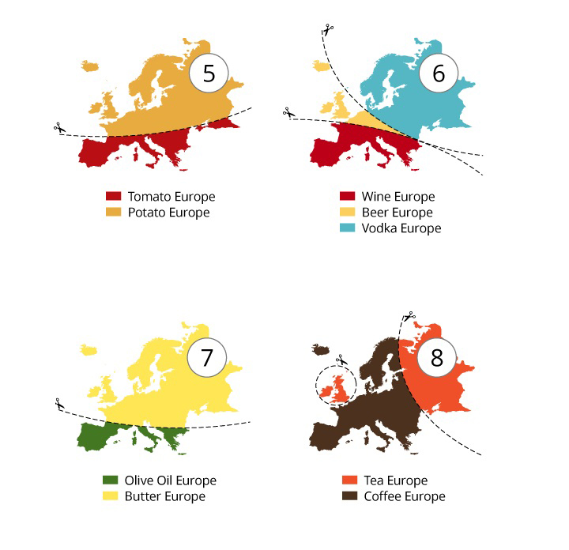
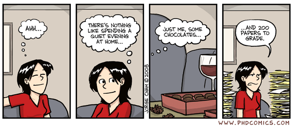

### შეხვედრა 1 (23 სექტემბერი)

### შეხვედრა 2 (30 სექტემბერი)

* სემინარი: ს. გვარჯალაძის დოკუმენტური ფილმი [,,პლანეტა გლდანი"](https://www.youtube.com/watch?v=DzT3r2q6F7I)

ძირითადი საკითხავი მასალა:

* რიდერი (სალუქვაძე), გვ. 4-7.

დამატებითი საკითხავი მასალა:

* კულტურის კვლევები (დიურინგი), გვ. 7-20

### შეხვედრა 3 (7 ოქტომბერი)

ძირითადი საკითხავი მასალა:

* სემინარი: 
	+ ა.ს. პუშკინი. ,,კავკასია". [ორიგინალი რუსულ ენაზე](http://rvb.ru/pushkin/01text/01versus/0423_36/1829/0509.htm), [ქართული თარგმანი](http://lexi.ge/news/1/2013-10-06-2042)
	+ გ. გაბაშვილი. [,,სამარყანდის ბაზარი''](https://www.dropbox.com/s/1c21t0smo87vucr/Gabashvili_Samarkand.jpg?dl=0)
	+ ბ. კუსტოდიევი. [,,ყველიერი''](https://www.dropbox.com/s/4mapde0g32u6aif/Kustodiev_Maslennitsa.jpg?dl=0)
	+ ბ. კუსტოდიევი. [,,ბოლშევიკი''](https://www.dropbox.com/s/ulxdsghy32tnwq3/Kustodiev_Bolshevik.jpg?dl=0)
* რიდერი (წერეთელი), გვ. 8-12

დამატებითი საკითხავი მასალა:

* ქრენგი, მ. [,,კულტურის გეოგრაფია''](https://www.dropbox.com/s/84fu3a2dv431sp0/%E1%83%99%E1%83%A3%E1%83%9A%E1%83%A2%E1%83%A3%E1%83%A0%E1%83%98%E1%83%A1_%E1%83%92%E1%83%94%E1%83%9D%E1%83%92%E1%83%A0%E1%83%90%E1%83%A4%E1%83%98%E1%83%90%20%28%E1%83%A5%E1%83%A0%E1%83%94%E1%83%9C%E1%83%92%E1%83%98%29.pdf?dl=0). სტატია საზოგადოებრივი გეოგრაფიის საერთაშორისო ენციკლოპედიაში.

### შეხვედრა 4 (14 ოქტომბერი) - დასვენება

### შეხვედრა 5 (21 ოქტომბერი) - დასვენება

### შეხვედრა 6 (28 ოქტომბერი)

* ქვიზი:
	+ სალუქვაძე (გვ. 4-7)
	+ დიურინგი (გვ. 7-20)
	+ წერეთელი (გვ. 8-12)
	+ ქრენგი (მთლიანად)

### შეხვედრა 7 (4 ნოემბერი)
	
* სემინარი: ი. გრიშაშვილი. [,,ძველი ტფილისის ლიტერატურული ბოჰემა"](https://drive.google.com/file/d/0B5jRhsETO1D2TVpNRHNvLWY2NFk/view?usp=sharing). გაითვალისწინეთ, რომ ფაილის წასაკითხად დაგჭირდებათ DJVU Reader-ი, რომელიც [ამ ბმულიდან შეგიძლიათ, ჩამოტვირთოთ](http://djvu.com/download/)

სასურველია, წიგნი სემინარის დაწყებამდე წაიკითხოთ

### შეხვედრა 8 (11 ნოემბერი) - შუალედურების კვირა

### შეხვედრა 9 (18 ნოემბერი)

* სემინარი: 
	+ [ტორსტენ ჰაგერშტრანდის ინოვაციების სივრცითი დიფუზიის მოდელი](https://www.openabm.org/model/3163/version/2/view)
	+ ჯონ ქონვეის [,,სიცოცხლის თამაში''](https://en.wikipedia.org/wiki/Conway%27s_Game_of_Life) 

### შეხვედრა 10 (25 ნოემბერი)
###### ქვიზი:

* კულტურული რეგიონები:
	+ სალუქვაძე (გვ. 8-15)
	+ წერეთელი (გვ. 12-13)
* კულტურული დიფუზია
	+ სალუქვაძე (გვ. 15-21)
	+ წერეთელი (გვ. 13-16)
	
### შეხვედრა 11 (2 დეკემბერი)
* სემინარი:
	+ კულტურული ეკოლოგია
	+ კულტურული ინტეგრაცია

### შეხვედრა 12 (9 დეკემბერი)
###### ქვიზი:

* კულტურული ეკოლოგია:
	+ სალუქვაძე (გვ. 21-25)
* კულტურული ინტეგრაცია
	+ სალუქვაძე (გვ. 25-27)

### შეხვედრა 13 (11 დეკემბრის კვირა)

###### შუალედური გამოცდა
თემები:

* კულტურის გეოგრაფიის ძირითადი საკითხები
	+ სალუქვაძე (გვ. 4-7)
	+ დიურინგი (გვ. 7-20)
	+ წერეთელი (გვ. 8-12)
	+ ქრენგი (მთლიანად)
* კულტურული რეგიონები:
	+ სალუქვაძე (გვ. 8-15)
	+ წერეთელი (გვ. 12-13)
* კულტურული დიფუზია
	+ სალუქვაძე (გვ. 15-21)
	+ წერეთელი (გვ. 13-16)
* კულტურული ეკოლოგია:
	+ სალუქვაძე (გვ. 21-25)
* კულტურული ინტეგრაცია
	+ სალუქვაძე (გვ. 25-27)

### შეხვედრა 14 (23 დეკემბერი)
###### ქვიზი:

* კულტურული ლანდშაფტი:
	+ სალუქვაძე (გვ. 27-31)
* სოფლის მეურნეობის კულტურული რეგიონები:
	+ წერეთელი (გვ. 30-33)
	

### შეხვედრა 15 (30 დეკემბერი)
###### ქვიზი:

* პოლიტიკური გეოგრაფია და რელიგია:
	+ წერეთელი (გვ. 34-38)
* ქალაქი და ურბანული გარემო:
	+ მანუელ კასტელსი (1979): _ურბანული კრიზისის პოლიტიკა, მოძრაობები ‘ქვემოდან’ და პოლიტიკური პროცესი_. ჩამოტვირთეთ [ამ ბმულიდან](https://www.dropbox.com/s/4qlvljub36a7n05/%E1%83%99%E1%83%90%E1%83%A1%E1%83%A2%E1%83%94%E1%83%9A%E1%83%A1%E1%83%98_%E1%83%A3%E1%83%A0%E1%83%91%E1%83%90%E1%83%9C%E1%83%A3%E1%83%9A%E1%83%98_%E1%83%9B%E1%83%9D%E1%83%AB%E1%83%A0%E1%83%90%E1%83%9D%E1%83%91%E1%83%94%E1%83%91%E1%83%98.pdf?dl=0)
	

### საბოლოო დავალება:
დავალების აღწერა ნახეთ მიმაგრებულ ფაილში. შაბლონებად შეგიძლიათ, რომელიმე ქვემოთ მოცემული ფაილი გამოიყენოთ. ფაილი გახსენით ფაუერ-ფოინთში და სურვილისამებრ შეცვალეთ

* [დავალების აღწერა](https://www.dropbox.com/s/v5cjxuazv59ohos/%E1%83%A0%E1%83%9D%E1%83%92%E1%83%9D%E1%83%A0%20%E1%83%9B%E1%83%9D%E1%83%95%E1%83%90%E1%83%9B%E1%83%96%E1%83%90%E1%83%93%E1%83%9D%E1%83%97%20%E1%83%9E%E1%83%9D%E1%83%A1%E1%83%A2%E1%83%94%E1%83%A0-%E1%83%9E%E1%83%A0%E1%83%94%E1%83%96%E1%83%94%E1%83%9C%E1%83%A2%E1%83%90%E1%83%AA%E1%83%98%E1%83%90.pdf?dl=0)
* პრეზენტაციის შაბლონები:
	+ [პირველი შაბლონი](https://www.dropbox.com/s/ghsi3mvts15y19t/%E1%83%A8%E1%83%90%E1%83%91%E1%83%9A%E1%83%9D%E1%83%9C%E1%83%98_2.ppt?dl=0)
	+ [მეორე შაბლონი](https://www.dropbox.com/s/kd7p9pdvcl76rx8/%E1%83%A8%E1%83%90%E1%83%91%E1%83%9A%E1%83%9D%E1%83%9C%E1%83%98_3_4.ppt?dl=0)
	+ [მესამე შაბლონი](https://www.dropbox.com/s/blaqhfslj6t8gy5/%E1%83%A8%E1%83%90%E1%83%91%E1%83%9A%E1%83%9D%E1%83%9C%E1%83%98_5_6.ppt?dl=0)
* [დავალების ასატვირთი ბმული](https://www.dropbox.com/request/4nns2VqEvis2IVBmQgqA)